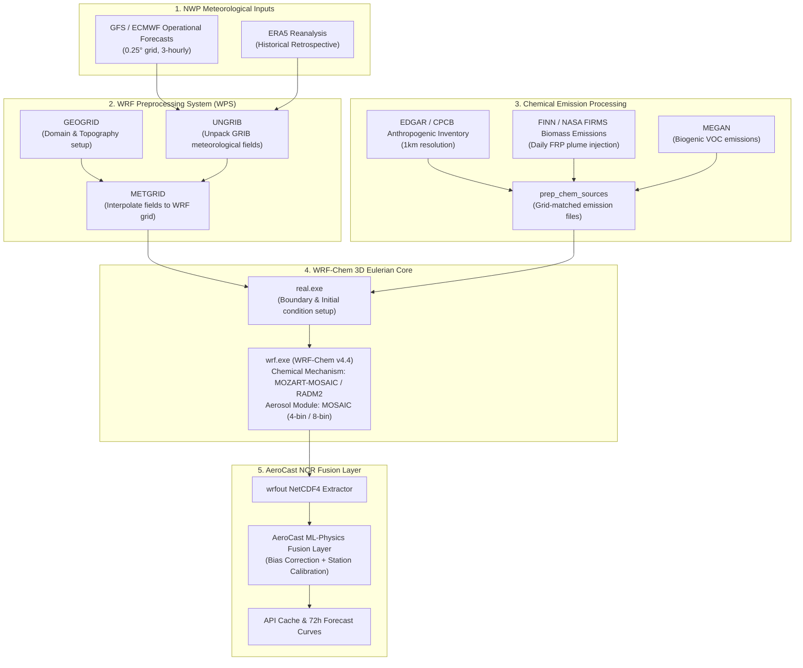

# WRF-CHEM INTEGRATION ARCHITECTURE & DATA CONTRACT SPECIFICATION

> **CURRENT STATUS NOTICE**: **WRF-Chem integration is not yet operational.**  
> AeroCast NCR currently uses a ML baseline (XGBoost Regressor + Physics-Guided Proxies). The architecture documented here represents the formal technical specification, input/output data contracts, and HPC pipeline for integrating 3D Eulerian atmospheric chemistry simulations (WRF-Chem) into AeroCast NCR.

---

## 1. Executive Summary & Purpose

While Machine Learning (XGBoost) achieves high precision for short-range (+1h to +6h) local persistence, mid-to-long range (+24h to +72h) air quality forecasting across complex regional domains like Delhi NCR requires solving non-linear 3D atmospheric chemistry equations:
- Advection and turbulent diffusion of pollutants across planetary boundary layers.
- Secondary inorganic aerosol formation ($\text{SO}_4^{2-}$, $\text{NO}_3^-$, $\text{NH}_4^+$) from gaseous precursors ($\text{SO}_2$, $\text{NO}_x$, $\text{NH}_3$).
- Photochemical ozone dynamics under variable solar radiation and biogenic VOC emissions.
- Biomass burning smoke plume injection height and regional transport from agricultural fire activity.

To achieve numerical defensibility aligned with Ministry of Earth Sciences (MoES) / IITM SAFAR standards, AeroCast NCR defines a modular WRF-Chem fusion interface layer.

---

## 2. Technical Architecture & Data Flow



---

## 3. High-Performance Computing (HPC) & Computational Requirements

Running WRF-Chem for a 72-hour forecast over a nested Delhi NCR domain ($3\text{km}$ inner resolution, $9\text{km}$ outer resolution) incurs high computational cost:

| Grid Parameter | Mother Domain (d01) | Nested Domain (d02) - NCR |
| :--- | :--- | :--- |
| **Domain Coverage** | North India ($1500\text{km} \times 1500\text{km}$) | Greater NCR ($300\text{km} \times 300\text{km}$) |
| **Spatial Resolution** | $9\text{km} \times 9\text{km}$ | $3\text{km} \times 3\text{km}$ |
| **Vertical Layers** | 35 ETA levels (10 within boundary layer) | 35 ETA levels |
| **Required HPC Cores** | 64 Cores (AMD EPYC / Intel Xeon) | 128 Cores |
| **RAM Requirement** | 128 GB DDR5 ECC | 256 GB DDR5 ECC |
| **Compute Time (+72h)** | ~3.2 hours wall-clock time | ~5.8 hours wall-clock time |

---

## 4. Input / Output Data Contract Schema

The API endpoint `/api/wrf-chem/stub` serves as the explicit JSON contract schema for receiving downscaled 3D chemical grid fields when the WRF-Chem HPC pipeline executes.

### API Contract Data Schema (JSON):
```json
{
  "integration_status": "research_specification",
  "wrf_version": "4.4.1",
  "domain_id": "d02_ncr",
  "grid_resolution_km": 3.0,
  "chemical_mechanism": "MOZART-MOSAIC",
  "forecast_run_timestamp": "2026-09-15T00:00:00Z",
  "grid_coordinates": {
    "min_lat": 27.5,
    "max_lat": 29.5,
    "min_lon": 76.0,
    "max_lon": 78.5
  },
  "species_output_units": {
    "PM2_5_DRY": "ug/m3",
    "PM10": "ug/m3",
    "NO2": "ppmv",
    "O3": "ppmv",
    "PBLH": "m",
    "VENTILATION_INDEX": "m2/s"
  },
  "data_contract_fields": [
    "timestamp",
    "lat",
    "lon",
    "pm25_wrfchem",
    "pm10_wrfchem",
    "no2_wrfchem",
    "o3_wrfchem",
    "pbl_height_m",
    "u10m",
    "v10m"
  ]
}
```

---

## 5. Machine Learning + WRF-Chem Hybrid Fusion Strategy

When WRF-Chem output becomes available operationalized, AeroCast NCR will employ a **Hybrid Physical-ML Fusion Model**:

$$\hat{y}_{t+h} = f_{\text{XGBoost}}\left(X_{\text{obs}}, X_{\text{met}}\right) + \alpha_h \cdot \left[ y_{\text{WRF-Chem}, t+h} - \mu_{\text{bias}}(h) \right]$$

1. **Short Horizons (+1h to +6h)**: $\alpha_h \to 0$. Machine learning persistence and surface sensors dominate predictions.
2. **Long Horizons (+24h to +72h)**: $\alpha_h \to 1$. Physical advection and chemical reactions from WRF-Chem govern multi-day transport.

---

## 6. Implementation Checklist for Operationalization

- [x] Defined WRF-Chem integration specification document (`docs/WRF_CHEM_INTEGRATION_SPEC.md`).
- [x] Defined mock/stub contract endpoint (`/api/wrf-chem/stub`).
- [ ] Deploy WRF Preprocessing System (WPS) on cloud HPC instance (AWS ParallelCluster / CPCB High Performance Computing Node).
- [ ] Configure FINN (Fire Inventory from NCAR) real-time ingest pipeline for daily FIRMS FRP biomass burning updates.
- [ ] Validate 3D NetCDF extractor and grid downscaling script (`pipelines/extract_wrfchem.py`).
